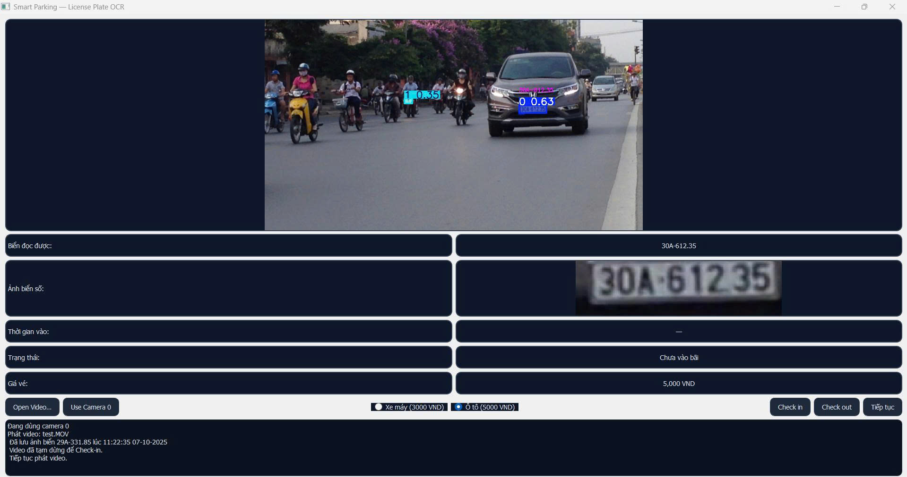
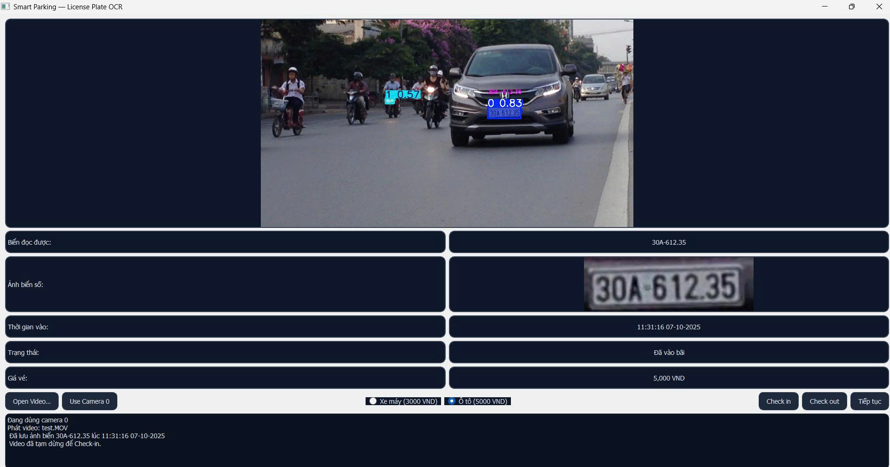
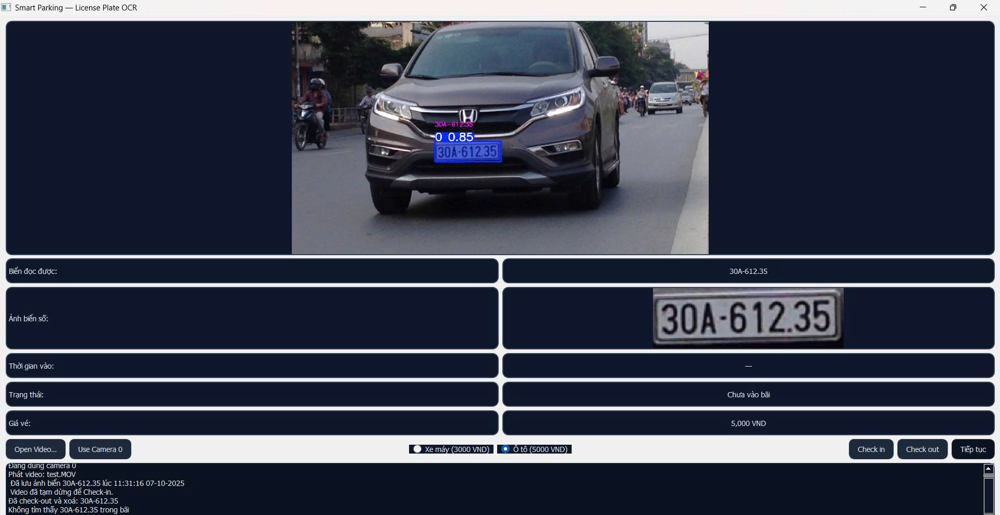

# Smart Parking — License Plate OCR

Một hệ thống quản lý bãi đỗ thông minh dùng nhận dạng biển số để check-in / check-out xe. Ứng dụng có giao diện PyQt5, sử dụng các model YOLO (được train bằng Ultralytics YOLOv8) để phát hiện biển và ký tự trên biển, sau đó lưu ảnh và trạng thái xe.

## Tổng quan
- Mục tiêu: Quay/video live stream từ camera hoặc phát file video, nhận dạng biển số, cho phép check-in (lưu ảnh & thời gian vào bãi) và check-out (xóa dữ liệu ảnh). Có giao diện trực quan để demo.
- Môi trường: Python 3.10+ (đã test trên Windows). Sử dụng PyQt5 cho UI, OpenCV để xử lý ảnh, Ultralytics (YOLOv8) cho detection/segmentation và nhận diện ký tự.

## Cấu trúc project
- `app.py` — Ứng dụng chính (PyQt5). Chịu trách nhiệm mở camera / video, vòng lặp xử lý frame, gọi pipeline OCR (`OcrPlate`), hiển thị ảnh, xử lý các nút Check in / Check out / Resume. Có một số cấu hình (đường dẫn model, thresholds, auto-capture config) ở đầu file.

- `ui_main.py` — Định nghĩa giao diện người dùng dưới dạng widget PyQt5 (layout, nút, nhãn, pane log). File này tách UI ra để dễ đọc/tuỳ chỉnh.

- `ocr_plate.py` — Pipeline OCR:
  - Tải 2 model YOLO (plate detection: segmentation/detection model; char detection: character detector).
  - Khi có mask hoặc bbox, thực hiện warp (vintage perspective transform) để cắt ROI biển, sau đó detect ký tự trong ROI.
  - Chứa hàm `format_vn_plate` để chuẩn hoá chuỗi biển theo format VN chung (thay O->0, I/L->1, ...; chuyển thành dạng HEAD-TAIL để hiển thị đẹp).
  - Hàm chính: `infer_image(image_bgr)` trả về: `annotated` (ảnh gán nhãn để hiển thị), `text` (chuỗi biển hoặc "unknown"), `score` (độ tin cậy trung bình ký tự), `roi_used` (ảnh ROI của biển nếu có).

- `check_and_save_img.py` — Lớp `CheckAndSaveImg` để lưu ảnh vào thư mục `image_data/<plate>/`, lấy dữ liệu thời gian vào, kiểm tra tồn tại (để biết xe đã vào bãi hay chưa), xóa thư mục khi check-out.

- `requirements.txt` — Danh sách phụ thuộc chính: `ultralytics`, `onnxruntime`, `PyQt5`, `opencv-python`, `numpy`.

- `model/` — Chứa 2 file model được training / export:
  - `best.pt` — Model YOLOv8 dùng để detect/segment biển (dùng khi gọi `OcrPlate(..., PLATE_WEIGHTS)`).
  - `best_ocr.pt` — Model YOLOv8/char detector cho ký tự trên biển.

- `image_data/` — Thư mục lưu trữ ảnh entry cho từng biển (mỗi biển một thư mục con). Thư mục mẫu đã có vài ảnh demo.

- `image_github/` — Một số ảnh demo khác dùng để test.

## Mô tả pipeline / models
- Model được train bằng Ultralytics YOLOv8 (yolov8n/yolov8s/yolov8m tùy cấu hình khi train). Trong project, code sử dụng API `from ultralytics import YOLO` để load các file `.pt`.
- `best.pt` có thể là một model segmentation/detection cho biển (khi có masks thì hệ thống dùng mask để warp và đọc ký tự), nếu không có masks hệ thống dùng bounding box lớn nhất.
- `best_ocr.pt` là model detection ký tự (class names sẽ được đọc từ `model_char.names`). Sau khi detection, các ký tự được sắp xếp theo toạ độ x (và xử lý 2 hàng nếu cần) để ghép thành chuỗi.
- Thông số điều chỉnh chính nằm ở `app.py` (đầu file) và khi khởi tạo `OcrPlate`:
  - `PLATE_WEIGHTS` & `CHAR_WEIGHTS` — đường dẫn tới model
  - `PLATE_MIN_SCORE`, `NO_PLATE_FRAMES`, `COOLDOWN_FRAMES`, `FRAME_STRIDE` — cấu hình auto-capture (một số logic auto-capture đã comment sẵn)
  - Trong `OcrPlate` có các tham số: `det_conf_plate`, `det_conf_char`, `iou_char`, `expand_margin`, `two_line_thr`, `imgsz`

## Cài đặt (Windows - PowerShell)
1. Tạo virtualenv (khuyến nghị):

```powershell
python -m venv .venv
.\.venv\Scripts\Activate.ps1
```

2. Cài đặt phụ thuộc:

```powershell
python -m pip install --upgrade pip
pip install -r requirements.txt
```

Ghi chú: `ultralytics` sẽ cài đặt phụ thuộc liên quan đến PyTorch/CPU hoặc GPU. Nếu muốn dùng GPU, cài PyTorch thích hợp trước khi cài ultralytics theo hướng dẫn https://pytorch.org. Nếu gặp vấn đề về ONNX/onnxruntime, `onnxruntime` trong `requirements.txt` đã bao gồm nhưng có thể cần phiên bản tương thích với platform.

## Chạy ứng dụng (UI demo)
1. Đảm bảo `model/best.pt` và `model/best_ocr.pt` tồn tại. Nếu muốn dùng model khác, cập nhật đường dẫn ở đầu `app.py`.
2. Mở PowerShell và active virtualenv (nếu có).
3. Chạy:

```powershell
python app.py
```

Ứng dụng sẽ mở cửa sổ PyQt5 với preview camera. Mặc định ứng dụng cố gắng mở camera `0`. Nếu muốn mở file video, dùng nút "Open Video…".

### Hướng dẫn demo trên UI
- Use Camera 0: mở camera mặc định (webcam). Nếu không mở được, thử chọn file video.
- Open Video…: chọn file video (.mp4, .avi, .mov, .mkv) để phát.
- Khi camera đang chạy, hệ thống sẽ liên tục infer từng frame (tùy cấu hình stride) và hiển thị:
  - Ảnh chính có ghi nhãn (annotated)
  - ROI biển (cột phải: "Ảnh biển số") nếu có
  - Biển đọc được (nhãn text)
  - Trạng thái: "Đã trong bãi" hoặc "Chưa vào bãi"
  - Thời gian vào (khi check-in)
  - Giá vé: chọn radio "Xe máy" (3000) hoặc "Ô tô" (5000)

- Check in: khi bấm, ứng dụng sẽ tạm dừng video, chụp khung hiện tại và lưu ảnh vào `image_data/<PLATE>/HH-MM-SS DD-MM-YYYY.jpg`. Đồng thời cập nhật label trạng thái và thời gian trên UI.
- Tiếp tục: bấm nút "Tiếp tục" để resume phát video.
- Check out: nếu biển đang tồn tại trong `image_data/`, bấm nút sẽ xóa thư mục (xóa entry) và cập nhật UI.
- Log: ô dưới cùng hiển thị lịch sử hành động (thông báo lưu ảnh, lỗi, v.v.).

## Demo — 3 trạng thái (dùng ảnh có sẵn trong `image_github/`)


Trong thư mục `image_github/` có sẵn ba ảnh dùng để demo ba trạng thái phổ biến của xe trong hệ thống:

- Minh hoạ trạng thái "Chưa vào bãi" (xe xuất hiện nhưng chưa được check-in)


- Minh hoạ trạng thái "Đã vào bãi" 


- Minh hoạ trạng thái "Đã rời bãi" (xe đã check-out và dữ liệu entry bị xóa)



